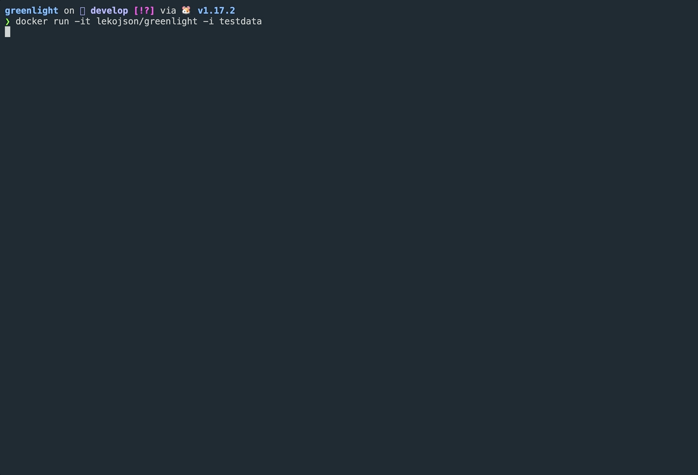

# Greenlight

<p align="center">
  
  <a href="https://hub.docker.com/r/lekojson/greenlight"
    ></a>
  <a href="https://hub.docker.com/r/lekojson/greenlight"
    ></a>
</p>

<p align="center">
  <a href="#-installation">Installation</a>
  ·
  <a href="#%EF%B8%8F-configuration">Configuration</a>
</p>

<h1></h1>



**The minimal, customizable, NeTEx validation tool**

- **Customizable:** configure what you see and how you see it.
- **Scripting** write your own validation rules using javascript
- **Fancy** shows relevant information at a glance.
- **Easy:** quick to install – start using it in minutes.

<br><br><br><br><br>

## 🚀 Installation

### Prerequisites

- [Docker](https://www.docker.com/) installed and ready to go
- (optional) [Go](https://go.dev/) - required if you are intending to build from source (latest build using 1.17.2)
- (optional) [libxml2](http://www.xmlsoft.org/) - required if you are intending to build from source

### Getting started

**Note**: if you don't have NeTEx xml document (or two) ready to test with we provide a few demo files in the source and docker image

#### 🐳 Using Docker

1. Getting the latest image
  ```sh
  docker pull lekojson/greenlight
  ```

2. Running a validation

   - #### With demo files provided in the image
  
   ```sh
   docker run -it lekojson/greenlight -i testdata
   ```

   - #### Providing your own files
  
   ```sh
   docker run -it -v /path/to/documents:/greenlight/documents lekojson/greenlight
   ```

#### 🛠️ Building from source

**Note**: Greenlight is using Go and is powered by libxml2, so make sure those are installed and configured

1. Clone repository
```sh
git clone https://github.com/concreteit/greenlight
```

2. Navigate to project
```sh
cd greenlight
```

3. Getting dependencies
```sh
go get
```

4. Building and running validation
   - #### Validate with demo files provided in the source
   _changes in path definition will differ running on windows_
   ```sh
   go run cmd/*.go validate -i testdata
   ```

   - #### Validate using your own files 
   _changes in path definition will differ running on windows_
   ```sh
   go run cmd/*.go validate -i /path/to/documents
   ```

### ⚙️ Configuration

<h1></h1>

<p align="center">
  
</p>

<p align="center">
  
</p>
