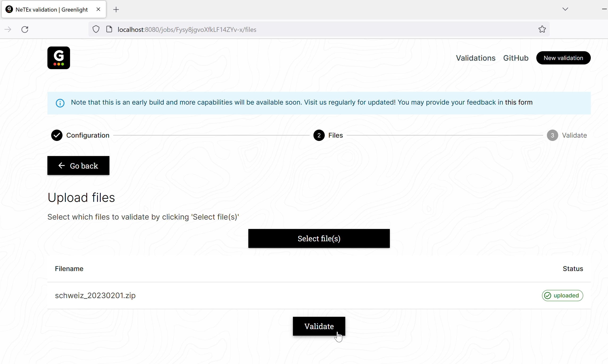
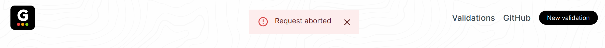
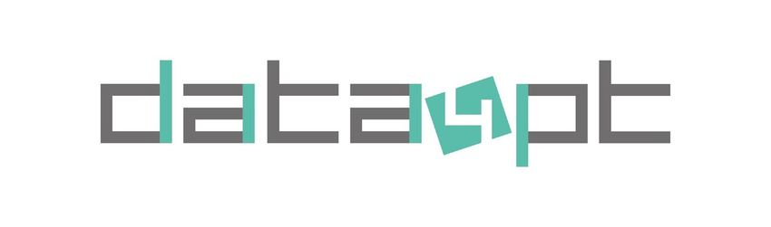

# Greenlight - The Data4PT Validation tool

<p align="center">
  
  <a href="https://hub.docker.com/r/itxpt/greenlight"
    ></a>
  <a href="https://hub.docker.com/r/itxpt/greenlight"
    ></a>
</p>

<p align="center">
  <a href="#-web-gui">Web</a>
  ·
  <a href="#%EF%B8%8F-cli">CLI</a>
  ·
  <a href="#%EF%B8%8F-building-from-source">Source</a>
  ·
  <a href="#%EF%B8%8F-configuration">Configuration</a>
</p>
<h1></h1>

<table>
<tr><td>


**The minimal, customizable, NeTEx validation tool**

- **Customizable:** configure what you see and how you see it.
- **Scripting** write your own validation rules using JavaScript
- **Fancy** shows relevant information at a glance.
- **Easy:** quick to install – start using it in minutes.
</td>
</tr>
</table>

# Table of Content
- [Greenlight - The Data4PT Validation tool](#greenlight---the-data4pt-validation-tool)
- [Table of Content](#table-of-content)
- [Introduction](#introduction)
- [Requirements](#requirements)
- [Getting started](#getting-started)
  - [Local installation](#local-installation)
- [Web interface](#web-interface)
  - [Navigation](#navigation)
  - [Configuration](#configuration)
  - [Packages](#packages)
  - [Custom configuration](#custom-configuration)
  - [Select files to validate](#select-files-to-validate)
  - [Validation result](#validation-result)
  - [Downloading the result](#downloading-the-result)
  - [Previous validation](#previous-validation)
  - [Technical error messages](#technical-error-messages)
- [Command Line Interface - CLI](#command-line-interface---cli)
  - [Getting help](#getting-help)
  - [Server command](#server-command)
  - [Validate command](#validate-command)
    - [NeTEx profile](#netex-profile)
    - [Rules](#rules)
    - [Providing files](#providing-files)
    - [Output](#output)
  - [Completion command](#completion-command)
- [Building from source](#building-from-source)
  - [Prerequisites](#prerequisites)
  - [Getting started](#getting-started-1)
  - [Building the CLI](#building-the-cli)
  - [Building the Web GUI](#building-the-web-gui)
- [Configuration](#configuration-1)
  - [Command line](#command-line)
  - [Environment variables](#environment-variables)
  - [Configuration file](#configuration-file)


&nbsp;
# Introduction
The tool consists of a number of components, each with a different responsibility. This will ensure that the tool is modular and that each component is easy to understand and maintain.


**Core** - This is the main component of the tool, it reads the configuration, handles file imports, calls the validation scripts and summarizes the result. The Core provides an API that other components use to control the validation or to get access to shared functions, e.g, in libXML. The API also makes it possible to extend the tool with different front ends, as the CLI and Web Interface.

**libXML** - An [open source, standard library](https://gitlab.gnome.org/GNOME/libxml2/-/wikis/home) integrated into the tool. It is libXML that does all the XSD and XML validation. It is called from the scripts via the API in the Core component.

**CLI** - The Command Line Interface is used in a terminal or integrated in an import/export pipeline. Parameters are used to configure the tool and to specify the files to be validated. The result can be read in the terminal or saved as a file.

**Web Interface** - Provides an easy to use interface via the web browser. The web interface makes the tool easer to use for the occasional user or for just testing small files. After loading the web page you can select the NeTEx profile to use, select one or more validation rules and then run the validation. After completion you get the result on the web page but can also download it to a file.

**Scripts** - Individual validation rules implemented as scripts. The scripts are written in JavaScript that is easy to start with and JavaScript is also well documented. The validation scripts are small programs that each implements one or more validation rules. The scrips provided with the tool implements one rule per script to make it easy to follow and understand how they work. To gain a better performance several rules can be implemented in the same script. Each script uses the API in Core to load the files to validate and to call functions in libXML. XPath provided via libXML is used by most of the scripts to search for and compare different elements in the NeTEx-files.
</p>

&nbsp;

# Requirements
To run the tool locally you must ensure that the machine used has the capability to handle the files to be validated. The validation times can be long and the tool can stop if the processing power or memory is to low. Below is a recommendation for the configuration of a machine. Be aware that very large or very many files affects the performance, and can result in longer validation times even on a machine with the recommended hardware.

| Minimum | Recommended | Best performance |
|---------| ------------| -----------------|
| 4 cores | 6 cores | 6 cores or more |
| 8 GB memory | 16 GB memory | 32 GB memory |


&nbsp;

# Getting started
To try out the tool for the first time and evaluate the functionality you can use our hosted web interface at https://greenlight.itxpt.eu See [Web Interface](#Web-interface) for an overview of how to use the tool with the visual interface.

If you find the tool useful and want to use it in more advanced scenarios, with larger files or include it in a pipeline, then you can download and install it locally in your own environment.

## Local installation

To use the tool locally, you need to install Docker on the computer that you will use. You can use Windows, Mac or Linux as your base operating system, and you will find Docker and instructions on how to install in the [Docker Getting Started](https://www.docker.com/get-started/) guide.

After you have installed Docker, you can get the latest version of the Greenlight image by typing the following command in a terminal window:

```
docker pull itxpt/greenlight
```


We suggest that you first start to use the web interface to verify that the installation works and to learn more about the functionality. 

Start the web interface with the command:

```
docker run -it -p 8080:8080 itxpt/greenlight server
```


If you have used the image before, you can also start the web interface via Docker Desktop, goto to the Containers tab and press Start on the Greenlight container.


&nbsp;

&nbsp;

# Web interface

After the container has started you can use the web interface by opening a web browser and type the address [http://localhost:8080/](http://localhost:8080/), and click on **Start validating** to start a new validation session. You can also always use the **New validation** button in the upper right corner to start over with a new validation.


&nbsp;

## Navigation
At the top of the web page is a menu bar and a progress indicator. The logo to the left always take you to the start page. **Validations** in the menu will show recent done validations, **GitHub** will take you to our page with documentation and the soure code and **New validation** will start over with a new validation. You can also use **Go back** to navigate to a previous step. 


&nbsp;

## Configuration

To start a validation, you first decide if you want to use a premade configuration package or use a custom configuration. The packages are predefined with schemas and rules that are commonly used together. To select your own combination of schemas and rules you can do a custom configuration.


&nbsp;

## Packages

If you select to use the premade packages you are presented with a list to select from. Select the one that works best with your validation requirements. When you click on one of the packages you continue to the [selection of files](##Select-files-to-validate).


&nbsp;

## Custom configuration

With the custom configuration you can be more detailed in which NeTEx Profile and combination of rules to use. In the list of rules, you get brief description of each rule. Zero or more rules can be selected by clicking the checkbox for each rule.


Some rules use parameters as input to the validation. Those rules have a default value that can be changed by clicking on the Configure icon to the right.


&nbsp;

## Select files to validate

The last step is to upload the files to be validated, it can be single files or multiple files compressed in an archive. Click **Select file(s)** to select which files to upload and then wait until all files has been uploaded, see the Status indicator in the files list.

If you want to get back to the selection of rules you can use the **Go back** button


&nbsp;

When all files are uploaded you start the validation by clicking on **Validate**.





&nbsp;

Each file is validated against the selected schema and rules, all validations run in parallel. Depending on the number of files and their sizes the validation can take some time to complete. 


&nbsp;

## Validation result

When the validation is done you get an overview of the result. You can see the status of the validation for each file. If there are any errors, you can get all the details by clicking on the down arrow to the right of each file. 


&nbsp;

The details display the number of times that specific error occurs in the file, and you can page between them with the arrows to the right. For each error you get information about the type, line number in the file and a more detailed explanation. 


&nbsp;

## Downloading the result
You can download the result for each error or the complete validation to a file in json or csv format to process it further. For example, to give as documentation to someone who can correct the error


Example of the saved data in json format.


&nbsp;

## Previous validation
At the bottom of the result page, you have an option **Validate with this configuration** to go back and start a new validation with the same configuration but with new files. You can also see recent validation by using the menu selection **Validations** at the to of the page. By clicking on the name of a job you will see the result page for that validation again.


&nbsp;

## Technical error messages
Sometimes the web interface will show error messages if the Greenlight tool stops to execute. Often that occurs when the communication to the web server is lost, or the local Docker version has stopped. Check the status of your connection and that the Docker container is running if using it locally.




&nbsp;

&nbsp;


# Command Line Interface - CLI
The CLI is for more advanced use cases where you want more control over the validation or if you want to include the validation in your own pipeline. An example could be to recieve a file via an integration, validate the file with GreenLight and if there are any errors inform via email and otherwise save the file for use in another system.

To use the CLI you must first download the Docker image as described in [Getting started](#getting-started)

When you use the CLI you first give the command ```docker``` and the parameters ```run -it [docker_image]``` in this case the docker_image is itxpt/greenlight. After that you give the different commands and flags to greenlight, e.g., ```help```. If you want to use other docker parameters, you have to put them before the name of the image to use. See below for more complex examples of how to invoke the greenlight command.

&nbsp;

## Getting help

The tool has a built in help system that gives explanations of all commands and parameters in the tool. Use the command below to get an overview of the help you can get.  
```sh
 docker run -it itxpt/greenlight help
```


&nbsp;

## Server command


```
docker run -it -p 8080:8080 itxpt/greenlight server
```

This will start the built in web interface and it can be accessed via [http://localhost:8080/](http://localhost:8080/). Se [Web Interface](#web-interface) for a guide on how to use it.


&nbsp;

## Validate command
A validation is started with the command ```Validate```, it uses the following flags as input to configure the validation.

```
Flags:
  -h, --help               help for validate
  -i, --input string       XML file, dir or archive to validate
  -l, --log-level string   Set level of log output (one of "trace", "debug", "info", "warn", "error") (default "debug")
  -o, --output string      Set which output format to use (one of "json", "xml", "csv", "pretty" (default "pretty")
  -p, --profile string     Set path of validation profile (note: flags 'rules' and 'schema' is ignored)
  -r, --rules strings      Set which validation rules to run (defaults to all inside the builtin dir)
  -s, --schema string      Which xsd schema to use (supported "netex@1.2", "netex@1.2-nc", "epip@1.1.1", "epip@1.1.1-nc") (default "netex@1.2-nc")
      --silent             Running in silent will only output the result in a boolean fashion
```

To verify that the tool works yo can do a validation with a NeTEx file provided with the tool.
```
 docker run -it itxpt/greenlight validate -i testdata
```

Example output from a validation done in the CLI


### NeTEx profile
To select NeTEx profile use the flag -s or --schema and the name of the profile. Valid names are netex@1.2, netex@1.2-nc, epip@1.1.1, epip@1.1.1-nc. If no schema is selected the netex@1.2-nc is used. -nc at the end means that the validation is with No Constraints. Which is a faster validation but needs that the no-constraints rule is used instead.

Example of how to use the EPIP schema when validating the built in test file
```
docker run -it itxpt/greenlight validate -schema epip@1.1.1 -i testdata
```

### Rules
Select which rules to use with the flag -r or --rules and then give the name of the rules to use. Several rules can be specified by separating them with a comma. 

Example ```-r everyLineIsReferenced,everyScheduledStopPointHasAName```

You can change or add your own rules by cloning the greenlight repo from GitHub and modify one of the scripts in the directory ```builtin```. Save it with a new name and then map the ```builtin``` folder to the docker container with the Docker parameter -v.

```-v c:\code\greenlight\builtin:/usr/local/greenlight/builtin```

Use the script in the same way as one of the standard scripts with the flag -r and name of the script.

Example ```-r mymodifiedrule```

### Providing files
The files to test can be single files, a folder with files or a compressed archive with files. Put the files to be tested in a local folder and use the docker parameter -v to map it with a folder in the greenlight container. 

```-v C:\code\netex\testdata:/usr/local/greenlight/testdata```

Then you can use the greenlight flag -i to include the files in the validation


&nbsp;

Command to validate a folder with files
```
docker run -it -v c:\code\netex\testfiles:/usr/local/greenlight/testdata itxpt/greenlight validate -s netex@1.2-nc -r everyLineIsReferenced -i testdata
```


&nbsp;

Command to validate an archive with several files
```
docker run -it -v c:\code\netex\testfiles:/usr/local/greenlight/testdata itxpt/greenlight validate -s netex@1.2-nc -r everyLineIsReferenced -i testdata/xt_2023_04_15.zip
```


&nbsp;

Command to validate a single file
```
docker run -it -v c:\code\netex\testfiles:/usr/local/greenlight/testdata itxpt/greenlight validate -s netex@1.2-nc -r everyLineIsReferenced -i testdata/line_2_9011005000200000.xml
```

### Output
The result of the validation can be presented in different formats. For example, the ```pretty``` will give an output adopted to be read on the screen. The other formats ```json```, ```xml``` and ```csv``` can be used to pipe the output to a file for further processing.

```
docker run -it itxpt/greenlight validate -s netex@1.2-nc -r everyLineIsReferenced -i testdata -o json > greenlight-result.json
```

&nbsp;

## Completion command
Generate an autocompletion script for Greenlight for different shells. The generated script can be added to your shell profile. Scripts can be generated for *bash*, *fish*, *zsh* and *powershell*.

**Note:** This command is for power users who uses the CLI a lot and want to make it easier and faster to type commands and parameters.

As an example, will the command below generate a script for bash
```
docker run -it itxpt/greenlight completion bash
```


&nbsp;

&nbsp;

# Building from source

## Prerequisites

- [Go](https://go.dev/)
- [libxml2](http://www.xmlsoft.org/)
- [nodejs](https://nodejs.org/) - not required if only running cli edition

## Getting started

**Note**: Greenlight is using Go and is powered by libxml2, so make sure those are installed and configured

1. Clone repository
```sh
git clone https://github.com/ITxPT/DATA4PTTools
```

2. Navigate to project
```sh
cd DATA4PTTools
```

3. Downloading dependencies
```sh
go get
```

## Building the CLI
Building and running a validation

- ### Validate with demo files provided in the source
   _changes in path definition will differ running on windows_
   ```sh
   go run cmd/*.go validate -i testdata
   ```

- ### Validate using your own files
   _changes in path definition will differ running on windows_
   ```sh
   go run cmd/*.go validate -i /path/to/documents
   ```

## Building the Web GUI
Building and running the backend server

- ### Build and start the server
  ```sh
  go run cmd/*.go server
  ```

- ### Navigate to directory
  ```sh
  cd app
  ```

- ### Install dependencies
  ```sh
  npm i
  ```

- ### Start the server
  ```sh
  npm run dev
  ```

- ### Open GUI
Open a browser and navigate to `http://localhost:3000`

---

<h1></h1>

<p align="center">
  
</p>

<p align="center">
  
</p>
